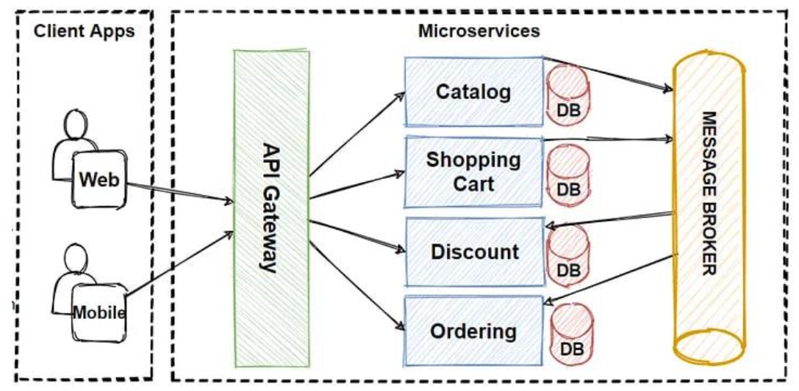

# Questions and answers:

#### Imagina que tenemos un sistema escrito en cualquier lenguaje de programación compilado, este sistema se conecta a una base de datos SQL, el sistema funciona muy bien cuando hay baja demanda de transacciones, pero cuando la cantidad de transacciones aumenta el sistema deja de responder solicitudes, se encontró que la base de datos es el cuello de botella y no acepta solicitudes en paralelo para completar las transacciones. 

¿Qué solución plantearías para receptar más cantidad de transacciones adaptándonos al cuello de botella de la base de datos?

> Este problema tiene varias soluciones, algunas de ellas son:

1. Se puede crear un pool de conexiones a la db sin embargo si el server de la db carece de recursos suficientes, esto no solucionará el problema. Entonces lo ideal sería crear el pool y también escalar el server de la db de forma horizaontal con replicas y particionamiento de datos. También se pueden verificar el tema de los indices y las queries que se están realizando para optimizarlas.

2. Se puede implementar un sistema de colas de mensajes, donde el sistema principal solo se encargue de enviar mensajes a la cola y un sistema secundario se encargue de procesar los mensajes de la cola y realizar las transacciones en la base de datos. De esta forma se puede escalar el sistema secundario para que pueda procesar más transacciones en paralelo.

3. Tambien se puede implementar un servicio de cache en memoria (Redis por ejemplo) para almacenar los resultados de las queries más comunes y así evitar realizar consultas a la base.

#### Se te ha asignado poder entender esta arquitectura para poder aplicarlo a un nuevo proyecto, se necesita que expliques a detalle cual es la función de cada término mostrado en la imagen, en caso de desconocer de uno de los términos, explicar lo que creas que significaría según el flujo que sigue cada proceso así mismo si existiera cosas que mejorarías agrégalo como un detalle junto a su ¿Por qué?

> La imagen muestra una arquitectura de microservicios, en la cual se pueden identificar los siguientes componentes:
> - **Client**: Es el cliente que realiza una petición al sistema.
> - **API Gateway**: Es el punto de entrada de las peticiones al sistema, se encarga de enrutar las peticiones a los microservicios correspondientes.
> - **Microservicios**: Es un microservicio que se encarga de realizar una tarea específica.
> - **Base de datos**: Es la base de datos que almacena la información del sistema.
> - **Message Broker**: Es un sistema de colas de mensajes que permite la comunicación entre los microservicios.

#### Se te ha asignado la tarea de presentar una nueva tecnología que mejorará el rendimiento del sistema de órdenes a un grupo de stakeholders que no son técnicos. La tecnología implica el uso de microservicios para mejorar la escalabilidad y reducir el tiempo de respuesta.

¿Cómo explicarías esta nueva tecnología y sus beneficios en términos no técnicos
para asegurar que todos comprendan su importancia y el impacto que tendrá en el
negocio?

> Piensen en una tienda grande con diferentes secciones, como ropa, electrodomesticos, alimentos, etc. Si todo se manejara desde una sola caja esta person no daría a basto y por la generar estaría muy cargada, ademas no sería sostenible mantenerla con conta demanda. También si algo se rompe, toda la tienda se vería afectada.

> Ahora imaginen que cada sección tiene su propia caja registradora y personal especializado. Esto haría que las compras fueran mucho más rápidas y se podrían atender mucho más clientes al mismo tiempo.

> Los microservicios funcionan de manera similar. En lugar de tener todo el sistema de órdenes como un solo bloque, lo divideremos en pequeñas partes que se encargarán de tareas específicas.

> Al implementar microservicios, nuestro sistema será más rápido, podrá manejar más órdenes sin problemas, y si algo se rompe, el impacto será menor. Esto mejorará la experiencia del cliente y hará que nuestro negocio sea más eficiente y resistente.

